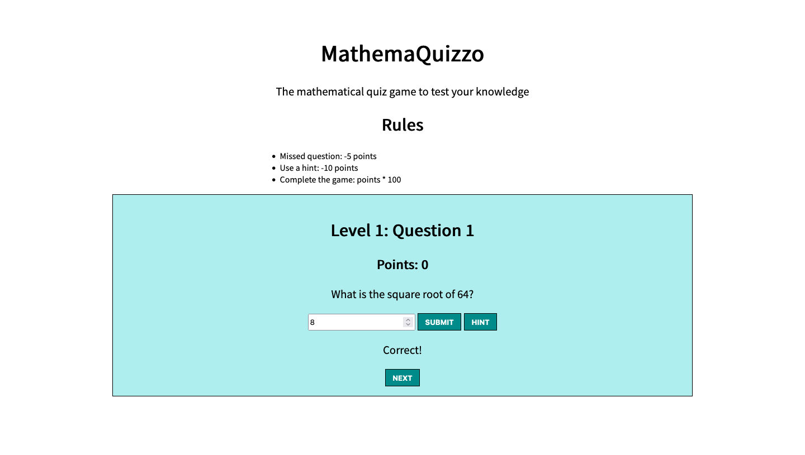
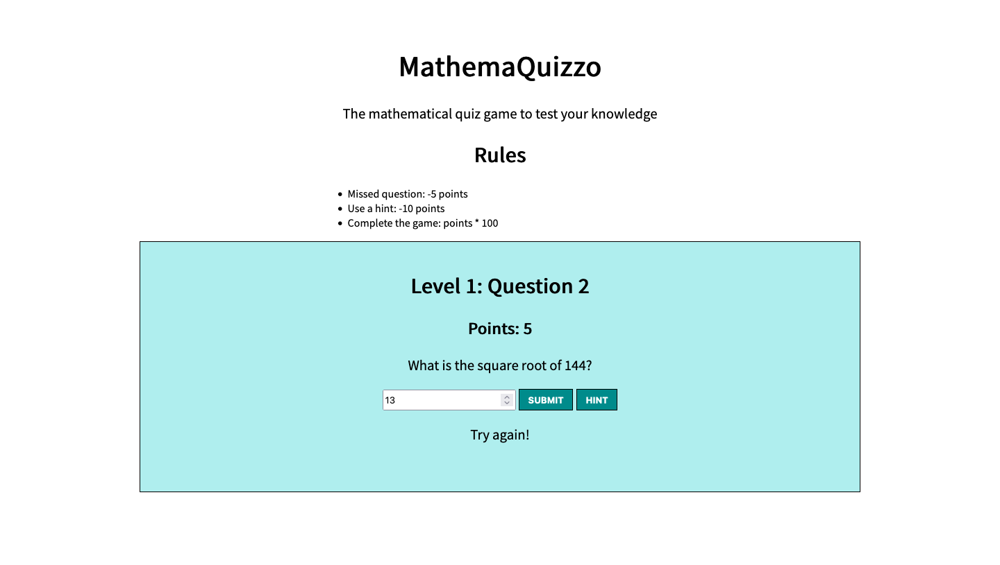
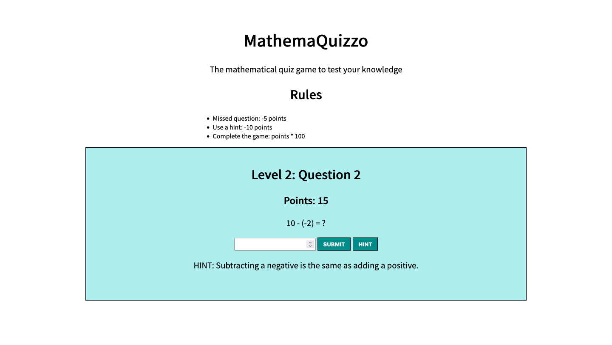

# MathemaQuizzo
A simple mathematical quiz game.

## Contents

- [Overview](#overview)
- [Screenshots](#screenshots)
- [My Process](#my-process)
- [Status](#status)
- [Connect](#connect)

## Overview
This app is one I created as part of a project I assigned to my middle school mathmeatics students. For their end-of-the-semester project they were to design a game which requires math in order to win the game. I chose to do the project too and, this case, create a quiz application which displays questions, awards points for correct answers, deduct points for wrong answers, and displays hints (with a deduciton in points).

### Requirements:

- At least 3 levels
- At least 2 mathematics questions per level 
- Players must answer the mathematics questions correctly before moving to the next level

## Screenshots

### Start screen:

### Question:

### Correct answer:

### Incorrect answer:

### Hint:

### Win:

## My Process

This app was built in stages. I started with a basic HTML outline and minimal styling before focusing on the JavaScript to add functionality. Initially, I started with a basic version where the player would submit there answer to the question and simply move on to the next question. However, once I got the functions for the buttons working properly to change the HTML, I added the points tracker as well as the 'Hint' button (which deducts points when used). I also added the functionality for the deduction of points for incorrect answers. 

Currently, the questions are pulled from a single set and all are eventually displayed, but in the future I would like to have the questions 'randomly' drawn from a set (though that may be outside the scope of this project and may fit better in a different app entirely). 

### Built with:

- HTML
- CSS
- JavaScript

## Status

A live version of this app can be viewed at [https://ananfito.github.io/mathemaquizzo/](https://ananfito.github.io/mathemaquizzo/).

## Connect 

- [Email](https://anthonynanfito.com/contact/)
- [LinkedIn](https://linkedin.com/in/anthonynanfito)
- [Portfolio](https://ananfito.github.io)
- [Blog](https://ananfito.hashnode.dev)
